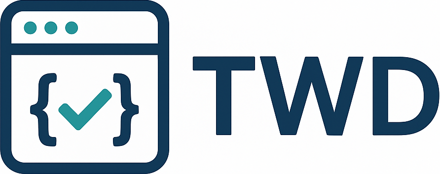

# TWD

[](https://github.com/BRIKEV/twd/actions/workflows/ci.yml)
[](https://www.npmjs.com/package/twd-js)
[](./LICENSE)
[](https://qlty.sh/gh/BRIKEV/projects/twd)
[](https://qlty.sh/gh/BRIKEV/projects/twd)

<p>
  
</p>

TWD (Testing Web Development) is a library designed to seamlessly integrate testing into your web development workflow. It streamlines the process of writing, running, and managing tests directly in your application, with a modern UI and powerful mocking capabilities.

**📖 [Full Documentation](https://brikev.github.io/twd/) | 🚀 [Getting Started](https://brikev.github.io/twd/getting-started) | 📚 [API Reference](https://brikev.github.io/twd/api/)**

## Features

- 🧪 **In-browser test runner** with a beautiful sidebar UI
- ⚡ **Instant feedback** as you develop
- 🔥 **Mock Service Worker** integration for API/request mocking
- 📝 **Simple, readable test syntax** (inspired by popular test frameworks)
- 🧩 **Automatic test discovery** with Vite support
- 🎯 **Testing Library support** - Use `screenDom` for semantic, accessible queries
- 🛠️ **Works with React** (support for more frameworks coming)

## Installation

```bash
npm install twd-js
# or
yarn add twd-js
# or
pnpm add twd-js
```

## Quick Start

### React / Vue / Angular / Other Frameworks (Bundled / recommended)

TWD now supports any framework via its bundled version.

```ts
// Only load the test sidebar and tests in development mode
if (import.meta.env.DEV) {
  const { initTWD } = await import('twd-js/bundled');
  const tests = import.meta.glob("./**/*.twd.test.{ts,tsx}");
  
  // Initialize TWD with tests and optional configuration
  // Request mocking is automatically initialized by default
  initTWD(tests, { 
    open: true, 
    position: 'left',
    serviceWorker: true,           // Enable request mocking (default: true)
    serviceWorkerUrl: '/mock-sw.js' // Custom service worker path (default: '/mock-sw.js')
  });
}
```

### Set Up Mock Service Worker

If you plan to use API mocking, set up the mock service worker:

```bash
npx twd-js init public
```

Check the [Framework Integration Guide](https://brikev.github.io/twd/frameworks) for more details.

## Writing Tests

```ts
// src/app.twd.test.ts
import { twd, userEvent, screenDom } from "twd-js";
import { describe, it } from "twd-js/runner";

describe("Hello World Page", () => {
  it("should display the welcome title and counter button", async () => {
    await twd.visit("/");
    
    // Use Testing Library queries (Recommended - semantic & accessible)
    const title = screenDom.getByRole("heading", { name: /welcome to twd/i });
    twd.should(title, "be.visible");
    twd.should(title, "have.text", "Welcome to TWD");
    
    const counterButton = screenDom.getByRole("button", { name: /count is/i });
    twd.should(counterButton, "be.visible");
    twd.should(counterButton, "have.text", "Count is 0");
    
    const user = userEvent.setup();
    await user.click(counterButton);
    twd.should(counterButton, "have.text", "Count is 1");

    // Alternative: Use TWD's native selectors for direct element access
    // const title = await twd.get("h1");
    // title.should("be.visible").should("have.text", "Welcome to TWD");
  });
});
```

3. **Run your app** - The TWD sidebar will appear automatically in development mode!

<p align="center">
  
</p>

## Key Concepts

### Element Selection

TWD supports two approaches:

**Testing Library Queries (Recommended):**
```ts
const button = screenDom.getByRole("button", { name: /submit/i });
twd.should(button, "be.visible");
```

**Native Selectors:**
```ts
const button = await twd.get("button");
button.should("be.visible");
```

### User Interactions

```ts
const user = userEvent.setup();
await user.click(button);
await user.type(input, "Hello World");
```

### API Mocking

```ts
twd.mockRequest("getUser", {
  method: "GET",
  url: "/api/user",
  response: { id: 1, name: "John" }
});

const rule = await twd.waitForRequest("getUser");
```

## Documentation

Full documentation is available at [twd.dev](https://twd.dev) (coming soon) or in the `docs` folder.

- [Getting Started](docs/getting-started.md)
- [Framework Integration](docs/frameworks.md)
- [Writing Tests](docs/writing-tests.md)
- [API Mocking](docs/api-mocking.md)

## Examples

Check out our working examples for various frameworks:

- **[Examples Directory](./examples)** - Local examples for React, Vue, and Astro
- **[Vue Example](https://github.com/BRIKEV/twd-vue-example)** - Vue 3 with advanced scenarios
- **[Solid Example](https://github.com/BRIKEV/twd-solid-example)** - Solid.js integration
- **[Angular Example](https://github.com/BRIKEV/twd-angular-example)** - Angular setup

Each example includes a complete setup guide and demonstrates best practices for testing with TWD including ci integration.

## Contributing

Contributions are welcome! Please open issues or pull requests on [GitHub](https://github.com/BRIKEV/twd).

## License

This project is licensed under the [MIT License](./LICENSE).
